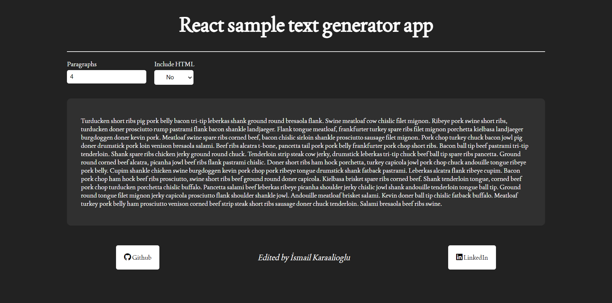
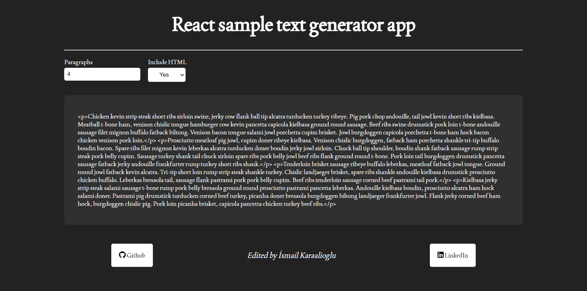

# React-TextGeneratorApp

* Patika.dev Redux modülü "Text Generator" çalışması.


## Kullandıgım Teknolojiler ve Araçlar
* React.js
* Redux
* Redux Toolkit

## API
* **HTML Response**
```
https://baconipsum.com/api/?type=all-meat&paras=2&format=html
```
* **Text Response**
```
https://baconipsum.com/api/?type=all-meat&paras=2&format=text
```

## Kurulum

1. Depoyu klonlayın ve bağlılıklarını kurun.
```
npm install or yarn install
```

2. Projeyi yerel olarak (localhost) başlatın.
```
npm start or yarn start
```

## Demo
* [https://ismailkaraalioglu-textgeneratorapp.netlify.app/](https://ismailkaraalioglu-textgeneratorapp.netlify.app/)


